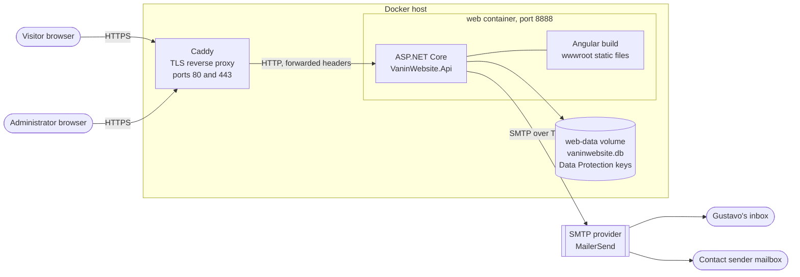
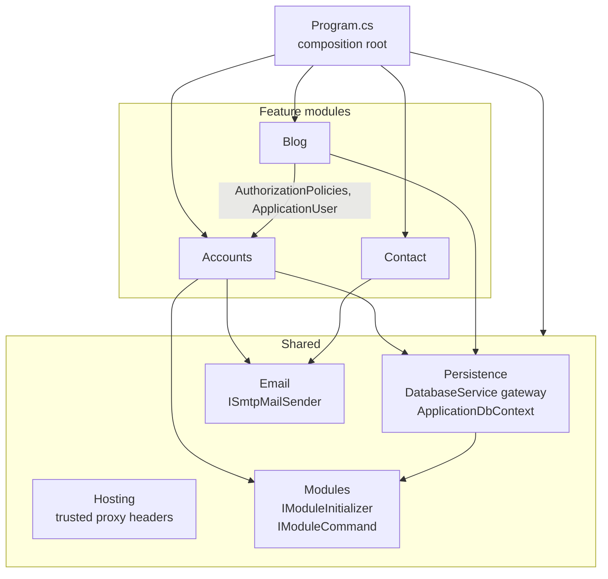
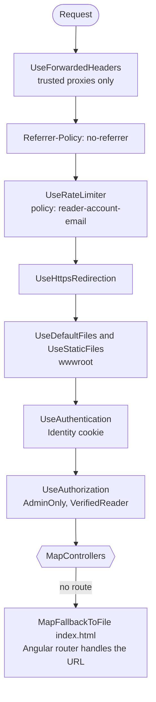
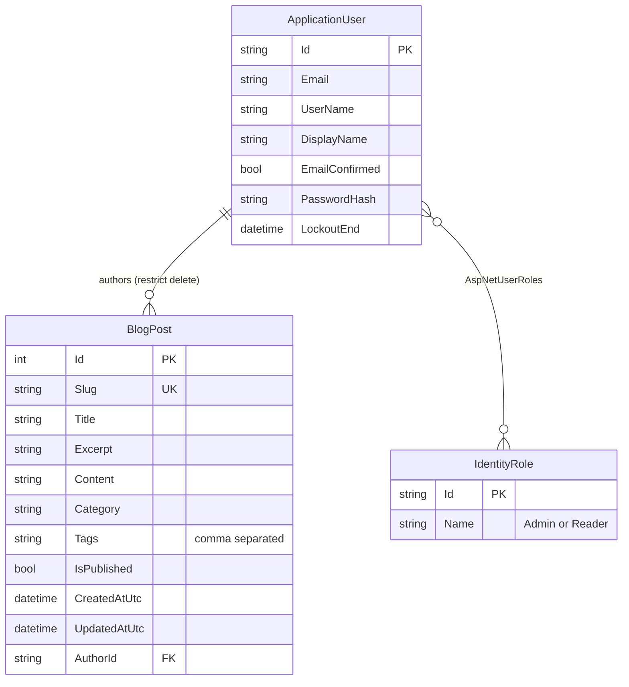
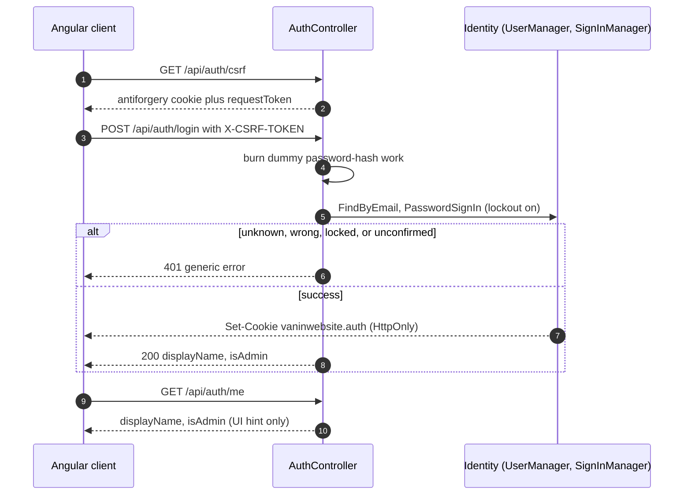
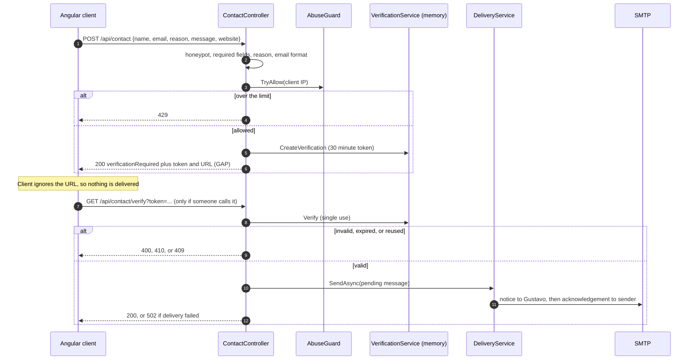
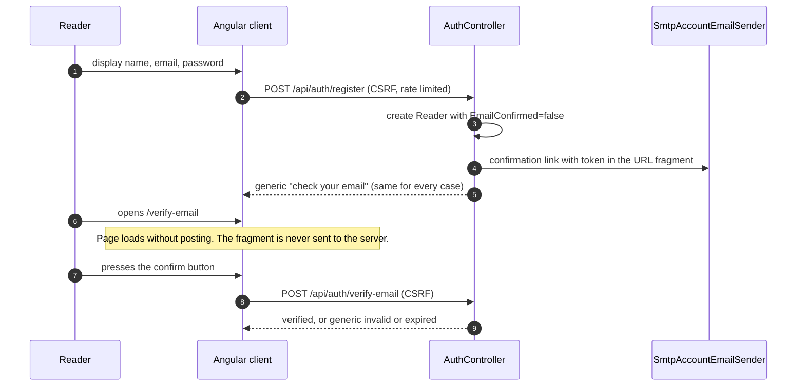
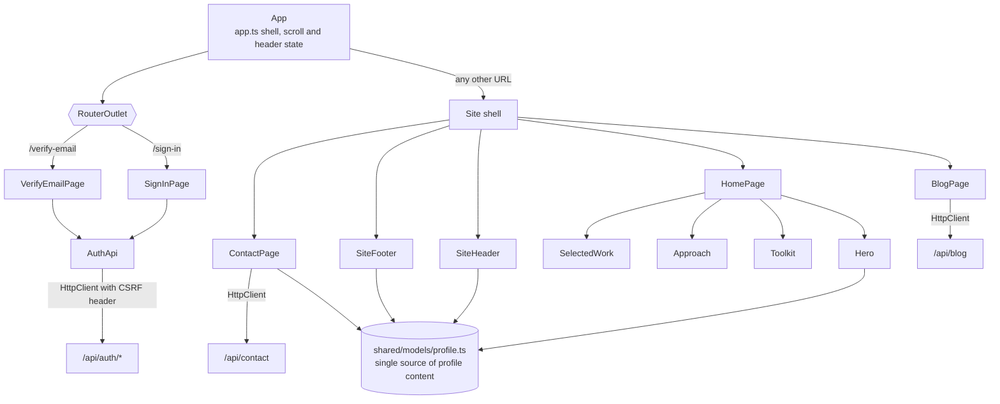
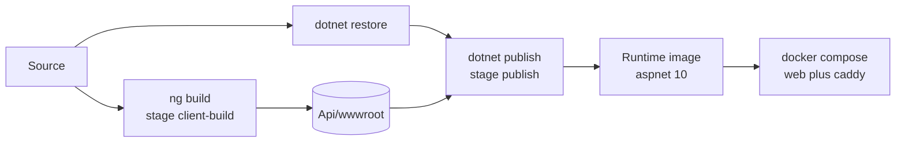

# VaninWebsite Architecture

**Audience:** AI agents and developers. Read this before implementing a feature or changing existing behavior.  
**Also for:** Gustavo, to see the product as it is built today. Diagrams are Mermaid and render in VS Code, GitHub, and most Markdown viewers.  
**Last verified against the code:** 2026-10-01

This document describes **what exists now**, not the target. For the target see [project.md](./project.md) and [product-backlog.md](./product-backlog.md). Where the code falls short of the target, section 11 lists the gap. Keep this file in the same change as any structural change.

Contents: [1 System](#1-system-context) · [2 Repository](#2-repository-layout) · [3 Backend](#3-backend-modules) · [4 Data](#4-data-model) · [5 Flows](#5-key-flows) · [6 Frontend](#6-frontend) · [7 Config and operations](#7-configuration-build-and-operations) · [8 Conventions](#8-conventions) · [9 Extending](#9-how-to-add-change-or-remove-a-feature) · [10 Testing](#10-testing) · [11 Known gaps](#11-known-gaps-and-technical-debt)

## 1. System context

One ASP.NET Core process serves both the JSON API and the compiled Angular client from a single origin. In Docker, Caddy terminates TLS in front of it. State is a SQLite file and a folder of Data Protection keys on one volume. Outbound mail goes through SMTP.



Runtime decisions that other code depends on:

- **Single origin.** The client calls relative `/api/...` URLs. There is no CORS configuration, and none should be added without a decision.
- **Trusted proxy only.** `X-Forwarded-For` and `X-Forwarded-Proto` are honored only from the addresses in `ForwardedHeaders:KnownProxies` (Caddy's fixed address in Compose). Client IP drives rate limiting, so never widen this.
- **Authorization lives in the API.** Angular route guards are conveniences only.

## 2. Repository layout

```text
VaninWebsite/
├── VaninWebsite.slnx                 Solution (API + tests)
├── Directory.Build.props             Shared .NET settings (net10.0, nullable, implicit usings)
├── Dockerfile                        Three stages: client build, .NET publish, runtime
├── docker-compose.yml                web + caddy, private network, one data volume
├── Caddyfile                         TLS reverse proxy to web:8888
├── .env.example                      Template for SMTP and domain settings (copy to .env)
├── CLAUDE.md                         Instructions for AI agents working in this repo
├── Docs/
│   ├── goal.md                       Executive purpose (the ultimate goal)
│   ├── project.md                    Scrum roadmap and high-level technical spec
│   ├── architecture.md               This file
│   ├── product-backlog.md            Stories and acceptance tests
│   ├── f3-authentication-architecture.md   Design record for accounts
│   ├── Api/VaninWebsite.http         Sample requests for the REST client
│   └── archive/                      Superseded documents
├── src/
│   ├── VaninWebsite.Api/             ASP.NET Core application
│   │   ├── Program.cs                Composition root, one line per module
│   │   ├── Modules/                  One folder per feature (section 3)
│   │   │   ├── Accounts/
│   │   │   ├── Blog/
│   │   │   └── Contact/
│   │   ├── Shared/                   Cross-cutting infrastructure (section 3.2)
│   │   │   ├── Email/  Hosting/  Modules/  Persistence/
│   │   ├── Data/                     SQLite file for local development (git-ignored)
│   │   ├── data-protection-keys/     Local cookie-protection keys (git-ignored)
│   │   ├── wwwroot/                  Angular build output (git-ignored)
│   │   └── appsettings*.json
│   └── VaninWebsite.Client/          Angular application (section 6)
└── tests/
    └── VaninWebsite.Api.Tests/       xUnit tests (section 10)
```

Inside each backend module the folders mean the same thing everywhere:

| Folder | Holds |
| --- | --- |
| `Controllers/` | HTTP endpoints only: bind, authorize, call a service, map to a contract |
| `Contracts/` | Request and response DTOs that cross the HTTP boundary |
| `Domain/` | Entities, constants, and EF mapping owned by the module |
| `Services/` | Business logic, repositories, and adapters to outside systems |
| `Models/` | Internal types that never leave the module's services |
| `Authorization/` | Policies and handlers (Accounts only) |
| `<Name>Module.cs` | The single `Add<Name>Module` extension that registers everything above |

## 3. Backend modules

### 3.1 Dependency rules



- `Program.cs` may reference every module; modules never reference `Program`.
- **Contact** depends on `Shared` only. **Accounts** depends on `Shared`. **Blog** depends on `Shared` and on `Accounts` (for the author entity and the authorization policy names). Do not add the reverse direction. If two modules need the same thing, move it into `Shared`.
- `Shared` never references a module, with one deliberate exception: `ApplicationDbContext` and `DatabaseService` know `ApplicationUser` from Accounts, because Identity shares the database. Every other module table is discovered through `IEntityTypeConfiguration<T>` without `Shared` naming it.
- **All database reads and writes go through `DatabaseService`.** A module keeps its own query logic in a service or repository (what to ask for) but calls the gateway (how to ask). Never inject `ApplicationDbContext`, `UserManager`, or `RoleManager` into a module class other than Identity registration. This keeps sanitization and access checks in one place as features grow.

### 3.2 Shared layer

| Component | What it does | Used by |
| --- | --- | --- |
| `Shared/Persistence/DatabaseService` | **The single gateway for every database read and write.** Generic entity access (`Read<T>`, `ReadForUpdate<T>`, `FindAsync<T>`, `Add`, `Remove`, `SaveChangesAsync`) plus the account store (users, roles). Modules never use `ApplicationDbContext`, `UserManager`, or `RoleManager` directly. Input sanitization and access checks are not implemented yet (F7-US1); this class is where they will go. | Accounts, Blog |
| `Shared/Persistence/ApplicationDbContext` | The EF Core context behind the gateway. Applies every `IEntityTypeConfiguration<T>` found in the assembly. | `DatabaseService` only |
| `Shared/Persistence/PersistenceServiceCollectionExtensions` | `AddSharedPersistence`: registers SQLite and resolves a relative database path against the content root, so the working directory never matters | `Program.cs` |
| `Shared/Persistence/DatabaseInitializer` | First `IModuleInitializer`: runs `EnsureCreated` | startup |
| `Shared/Modules/IModuleInitializer` | A module's startup hook (for example, create roles). Run in registration order after the database exists. | Accounts, Persistence |
| `Shared/Modules/IModuleCommand` | A module's operator command-line entry point. If one handles the arguments, the web host does not start. | Accounts (`admin provision`) |
| `Shared/Email/ISmtpMailSender` | The only class that talks to SMTP. Returns `false` and logs only the exception type on failure. | Accounts, Contact |
| `Shared/Hosting/AddTrustedProxyHeaders` | Forwarded-header trust from configuration | `Program.cs` |

Startup order in `Program.cs`: register shared services, register modules, build, run all `IModuleInitializer`s, offer the arguments to all `IModuleCommand`s, then configure the pipeline.

### 3.3 Request pipeline



### 3.4 Accounts module

Owns identity, sessions, and authorization. Source: `Modules/Accounts/`.

| Piece | File | Notes |
| --- | --- | --- |
| Registration of everything | `AccountsModule.cs` | Identity options, cookie, antiforgery, Data Protection, rate limit, policies |
| Roles | `Domain/AccountRoles.cs` | `Admin`, `Reader`. Server-managed; never accepted from a client |
| User entity | `Domain/ApplicationUser.cs` | Identity user plus `DisplayName` |
| Policies | `Authorization/AuthorizationPolicies.cs` | `AdminOnly`, `VerifiedReader`. Other modules reference these constants |
| Live verification check | `Authorization/VerifiedReaderAuthorizationHandler.cs` | Reads `EmailConfirmed` and role from the database on every call, so a stale cookie cannot authorize |
| Endpoints | `Controllers/AuthController.cs` | See the table below |
| Role seeding | `Services/AccountRoleInitializer.cs` | Creates missing roles at startup, never users |
| Admin provisioning | `Services/AdminProvisioningService.cs`, `AdminProvisioningCommand.cs` | Interactive operator command; refuses existing accounts; never promotes a user |
| Verification email | `Services/IAccountEmailSender.cs`, `SmtpAccountEmailSender.cs` | Separate from contact delivery on purpose |

Security settings in force: unique email, password minimum 12 characters with no composition rule, lockout after 5 failures for 15 minutes, email confirmation required to sign in, confirmation token lifetime 24 hours, cookie `vaninwebsite.auth` (HttpOnly, SameSite=Lax, Secure always in Production, 30-minute sliding expiry, not persistent), antiforgery cookie `vaninwebsite.csrf` with header `X-CSRF-TOKEN`. Cookie events return 401 and 403 rather than redirecting.

| Endpoint | Auth | Purpose |
| --- | --- | --- |
| `GET /api/auth/csrf` | anonymous | Issue antiforgery cookie and request token |
| `GET /api/auth/reader-registration` | anonymous | Whether reader registration is enabled |
| `POST /api/auth/login` | anonymous, CSRF | Sign in; same generic error for unknown, wrong, locked, or unconfirmed |
| `POST /api/auth/logout` | signed in, CSRF | Sign out |
| `GET /api/auth/me` | signed in | Display name and server-derived `isAdmin` |
| `POST /api/auth/register` | anonymous, CSRF, rate limited | Create unconfirmed Reader; always the same response. Returns 404 unless `Auth:ReaderRegistration:Enabled` is true |
| `POST /api/auth/verification/resend` | anonymous, CSRF, rate limited | Resend confirmation; generic response |
| `POST /api/auth/verify-email` | anonymous, CSRF, rate limited | Confirm with `userId` and `token` from the link |

### 3.5 Contact module

Owns the public contact form. Source: `Modules/Contact/`. It keeps no durable data.

| Piece | File | Notes |
| --- | --- | --- |
| Registration | `ContactModule.cs` | Binds `ContactOptions`; singletons for the token store and abuse guard |
| Endpoints | `Controllers/ContactController.cs` | `POST /api/contact`, `GET /api/contact/verify?token=` |
| Abuse guard | `Services/ContactSubmissionAbuseGuard.cs` | Thread-safe sliding window per socket IP, bounded client count, configured under `Contact:RateLimit` |
| Pending store | `Services/ContactVerificationService.cs` | In-memory, 30-minute lifetime, single use, removed on use or expiry |
| Delivery | `Services/ContactEmailDeliveryService.cs` | Two messages through `ISmtpMailSender`: one to Gustavo, one acknowledgement to the sender |

Validation on `POST /api/contact`: honeypot field `website` must be empty, all four fields required, `reason` must be `Work or collaboration` or `Personal note`, email must be well formed, then the rate limit applies (HTTP 429 before any token is created). Logs carry the reason and a client key, never the sender's address or the message body.

### 3.6 Blog module

Owns posts. Source: `Modules/Blog/`. It is the seed for Stories and Projects (F4, F5).

| Endpoint | Auth | Purpose |
| --- | --- | --- |
| `GET /api/blog?search&category&page&pageSize` | public | Published posts only; page size clamped to 50 |
| `GET /api/blog/{slug}` | public | One published post |
| `POST /api/blog` | `AdminOnly`, CSRF | Create; records the author and generates a collision-safe slug |
| `PUT /api/blog/{id}` | `AdminOnly`, CSRF | Update |
| `DELETE /api/blog/{id}` | `AdminOnly`, CSRF | Delete |

`BlogController` depends on `IBlogPostRepository` (implemented by `BlogPostRepository`), which holds the blog's query logic and performs every read and write through `DatabaseService`. The table mapping is in `Domain/BlogPostConfiguration.cs`.

### 3.7 Authorization matrix

| Operation | Anonymous | Reader, unconfirmed | Reader, confirmed | Admin |
| --- | --- | --- | --- | --- |
| Read published blog posts | yes | yes | yes | yes |
| Submit contact form | yes (rate limited) | yes | yes | yes |
| Create, update, delete posts | no (401) | no (cannot sign in) | no (403) | yes |
| Comment actions (R3, `VerifiedReader`) | no | no | yes | not by role alone |

## 4. Data model



Identity also creates its standard claim, login, and token tables; they are omitted here. Contact messages are **not** stored. The pending verification dictionary exists only in process memory.

The schema is created with `EnsureCreated`. It cannot change an existing database, so the first schema change (expected with F4) must be preceded by enabler TE1 (migrations).

## 5. Key flows

### 5.1 Sign-in with CSRF protection



### 5.2 Contact message, as implemented today

The diagram shows the code as it behaves, including the gap described in section 11. The target flow emails the link to the sender instead of returning it.



### 5.3 Reader registration and verification (built, disabled by default)



## 6. Frontend

Angular 20 with standalone components, signals, SCSS, and the built-in router. Source: `src/VaninWebsite.Client/src/app/`.



| Folder | Holds |
| --- | --- |
| `app/features/auth/` | `api/` (AuthApi with CSRF handling), `models/`, `pages/` (sign-in, verify-email). Authentication pages hide the public shell. |
| `app/features/home/` | The home page and its sections: `hero`, `selected-work`, `approach`, `toolkit` |
| `app/features/blog/`, `app/features/contact/` | Self-contained feature components with their own template and styles |
| `app/layout/` | `site-header`, `site-footer` |
| `app/shared/` | `models/` (profile, navigation item), `styles/site.scss` shared layout rules |
| `src/styles.scss` | Global design tokens and font families |

The public site is one long page with anchors (`home`, `work`, `approach`, `blog`, `contact`); only the authentication screens are routed URLs. The client keeps the CSRF token in memory and requests a fresh one before each mutation (`AuthApi.postWithCsrf`). The contact form and blog section call the API with plain `HttpClient`.

Build facts: output goes to `../VaninWebsite.Api/wwwroot`; production budgets warn at 500 kB and fail at 1 MB for the initial bundle; `ng serve` proxies `/api` to `https://localhost:8889` through `proxy.conf.json`.

## 7. Configuration, build, and operations

### 7.1 Configuration reference

Configuration binds in this order of precedence, last wins: `appsettings.json`, `appsettings.{Environment}.json`, user-secrets (Development only), environment variables. Nested keys use `__` in environment variables (`Email__Smtp__Host`).

| Key | Purpose | Default |
| --- | --- | --- |
| `ConnectionStrings:Default` | SQLite database; a relative path resolves against the project folder | `Data Source=Data/vaninwebsite.db` |
| `Email:Smtp:Host`, `Port`, `Username`, `Password`, `FromEmail`, `FromName` | The shared SMTP sender. **Secrets: user-secrets or environment only** | empty; mail is skipped with a warning |
| `Contact:RecipientEmail` | Inbox for verified contact messages | empty; delivery is skipped |
| `Contact:RateLimit:MaxRequestsPerWindow`, `WindowMinutes`, `MaxTrackedClients` | Contact abuse guard | 5, 10, 10000 |
| `Auth:ReaderRegistration:Enabled` | Reader registration endpoints | `false`; `true` in Development |
| `PublicBaseUrl` | Base for links in emails | `https://localhost` |
| `DataProtection:KeysPath` | Cookie-key folder; must persist across restarts | `data-protection-keys` next to the project |
| `ForwardedHeaders:KnownProxies:N` | Trusted proxy IP addresses | none |

Set development secrets with `dotnet user-secrets` from `src/VaninWebsite.Api` (id `vaninwebsite-api`), for example `dotnet user-secrets set "Email:Smtp:Password" "<value>"`. For Docker, copy `.env.example` to `.env`. Never commit either.

### 7.2 Build and run

| Task | Command |
| --- | --- |
| Run API (serves built client) | `dotnet run --project src/VaninWebsite.Api` (HTTPS on 8889, HTTP 8888 redirects) |
| Build client | `npm ci` then `npm run build` in `src/VaninWebsite.Client` |
| Client dev server with proxy | `npm start` in `src/VaninWebsite.Client` |
| Run all .NET tests | `dotnet test VaninWebsite.slnx -p:SkipClientBuild=true` |
| Run client tests | `npm test -- --watch=false --browsers=ChromeHeadless` |
| Provision an administrator | `dotnet run --project src/VaninWebsite.Api -- admin provision` |
| Container stack | `docker compose up --build -d` (site at `https://localhost`) |

The API project's `BuildClient` target runs `npm run build` before every build unless `-p:SkipClientBuild=true` is passed. Some integration tests request `/verify-email` and expect the SPA fallback, so build the client at least once first.



### 7.3 Operations

- **State to back up:** the `web-data` volume (`/data/vaninwebsite.db` and `/data/keys`). Losing the keys signs everyone out; losing the database loses accounts and posts.
- **TLS:** Caddy uses its local CA for `localhost`. To trust it on Windows, export the root with `docker compose cp caddy:/data/caddy/pki/authorities/local/root.crt ./certs/caddy-root.crt` and import it into the current user's trusted roots. For a public site set `SITE_DOMAIN` to a real DNS name that points at the host with ports 80 and 443 open, and Caddy obtains a certificate automatically. Do not share the CA key held in the `caddy-data` volume.
- **Renamed volumes:** the Compose project is now `vaninwebsite` with volumes `web-data`, `caddy-data`, and `caddy-config`. A stack created before the rename has the old volume (for example `testwebsite_portfolio-data`) holding `testwebsite.db`. To keep that data, copy the volume's contents into `vaninwebsite_web-data` and rename `testwebsite.db*` to `vaninwebsite.db*`, with the stack stopped.
- **Logging policy:** log categories and counts only. Never log message bodies, email addresses, tokens, or passwords. Keep this when adding log lines.

## 8. Conventions

- **Layout:** one module per feature under `Modules/<Name>/`, folders as in section 2. Namespaces match folders (`VaninWebsite.Api.Modules.<Name>.<Folder>`).
- **Registration:** every module exposes exactly one `Add<Name>Module(...)` extension and is wired by one line in `Program.cs`. Startup work goes in an `IModuleInitializer`; operator commands go in an `IModuleCommand`.
- **Persistence:** entities and their `IEntityTypeConfiguration<T>` live in the owning module. Query logic lives in an interface in the module's `Services/`, and every read or write goes through `DatabaseService`. Controllers and modules do not use the context or Identity managers directly. Add a generic method to `DatabaseService` rather than bypassing it.
- **Contracts:** never return an entity from an endpoint. Use a request and response type in `Contracts/` with validation attributes. Never bind privilege-bearing fields (role, `EmailConfirmed`, ids of other users) from a request.
- **Authorization:** protect every write with a policy from `AuthorizationPolicies`, not bare `[Authorize]`, and add `[ValidateAntiForgeryToken]` to cookie-authenticated mutations.
- **Configuration:** bind settings to an options class (see `SmtpOptions`, `ContactOptions`). Do not read `IConfiguration` ad hoc in new code, and never hard-code addresses or credentials.
- **Mail:** build the message in the module, send it through `ISmtpMailSender`.
- **Style:** C# with nullable references enabled, file-scoped namespaces, primary constructors for dependency injection, `sealed` classes by default, a short comment saying why a type exists. TypeScript uses standalone components, signals, and typed models; one feature per folder under `app/features/`.
- **Naming:** `I<Name>` for seams, `<Name>Module`, `<Name>Controller`, `<Name>Repository`, `<Name>Configuration` for EF mappings.

## 9. How to add, change, or remove a feature

### Add a feature module (example: Comments)

1. Create `Modules/Comments/` with `Controllers/`, `Contracts/`, `Domain/`, `Services/` as needed.
2. Add the entity and a `CommentConfiguration : IEntityTypeConfiguration<Comment>` in `Domain/`. `ApplicationDbContext` finds it automatically.
3. Put the module's query logic behind `ICommentRepository` in `Services/`; it reads and writes only through `DatabaseService`.
4. Protect endpoints with `AuthorizationPolicies.VerifiedReader` (and CSRF on writes). Do not copy role checks.
5. Create `CommentsModule.cs` with `AddCommentsModule(...)` that registers the services (and an `IModuleInitializer` if needed).
6. Add one line to `Program.cs`: `builder.Services.AddCommentsModule();`.
7. Add tests in `tests/VaninWebsite.Api.Tests/`. Add a client feature under `app/features/comments/`.
8. Update this document (sections 3, 4, and the matrix) and the backlog evidence.
9. Until TE1 lands, a new table needs the migration work first; `EnsureCreated` will not add it to an existing database.

### Change a feature

Read its module's section here and its stories in the backlog. Keep changes inside the module and its contracts. If another module must change, the dependency rules in section 3.1 are probably being bent; stop and reconsider.

### Remove a feature

Delete the module folder, its registration line in `Program.cs`, its tests, and its client folder. `DatabaseService` and the other modules do not need edits (Blog is the only one that depends on another module, Accounts). Removing Accounts also removes the policies Blog uses, so remove or rework Blog first.

## 10. Testing

| Level | Location | What it covers |
| --- | --- | --- |
| Integration (host in memory) | `tests/VaninWebsite.Api.Tests/AuthApiIntegrationTests.cs`, `AuthApiFactory.cs` | Login, CSRF, cookie flags, lockout, expiry, registration, verification, authorization, rate limit. The factory swaps in an in-memory SQLite connection and a test mail sink. |
| Unit and service | `AdminProvisioningTests.cs`, `ContactFeatureTests.cs`, `SchemaCompatibilityTests.cs` | Provisioning rules; contact abuse guard (sequential, concurrent, bounded, expiry), honeypot, log privacy; pinned table and index names so existing databases keep working |
| Client | `*.spec.ts` beside components | Header sign-in link; verify-email page does not post until confirmed |

Test doubles: `TestAccountEmailSender` captures verification links; `StubContactEmailDeliveryService` and `StubContactVerificationService` replace contact collaborators; `AdjustableTimeProvider` and `CapturingLogger` support time and log assertions.

Current result (2026-10-01): 20 API tests and 2 client tests pass. Not covered: contact controller end to end through HTTP, blog endpoints, and every browser-level acceptance test (320 px, keyboard, contrast); see enabler TE5.

## 11. Known gaps and technical debt

Each item is also tracked in [project.md](./project.md) or the backlog.

| Gap | Where | Consequence | Tracked as |
| --- | --- | --- | --- |
| The contact verification link is returned in the API response and never emailed; the client ignores it | `ContactController.Send`, `contact-page.ts` | Email ownership is not proven and the browser form never delivers | F2-US2 |
| `GET /api/contact/verify` changes state | `ContactController.Verify` | A mail scanner that fetches the link would trigger delivery once the link is emailed | F2-US2 (use an explicit confirm action) |
| `EnsureCreated` instead of migrations | `Shared/Persistence/DatabaseInitializer.cs` | No safe schema evolution | TE1 |
| Pending contact messages are in process memory | `ContactVerificationService` | Lost on restart; single instance only | Accepted for R1 |
| Blog section ships hard-coded sample posts, the "selected work" section is placeholder, and the local dev database holds two demo posts | `blog-page.ts`, `selected-work` | Violates the R1 "no sample content" decision. Gustavo: leave until just before deployment | TE4 (deployment gate) |
| `DatabaseService` applies no input sanitization or access checks yet | `Shared/Persistence/DatabaseService.cs` | Safeguards must be repeated by callers until added | F7-US1 |
| No reader display-name update, password reset, or administrator recovery | Accounts | Recovery paths missing | F3-US3, F3-US4 |
| `SQLitePCLRaw.lib.e_sqlite3` advisory warning (NU1903) | `VaninWebsite.Api.csproj` | Known vulnerability in a transitive package | TE3 |
| No CI | repository | Regressions are not caught automatically | TE2 |
| Contact and blog HTTP behavior lack tests | `tests/` | Gaps above went unnoticed | F2-US2, TE5 |
