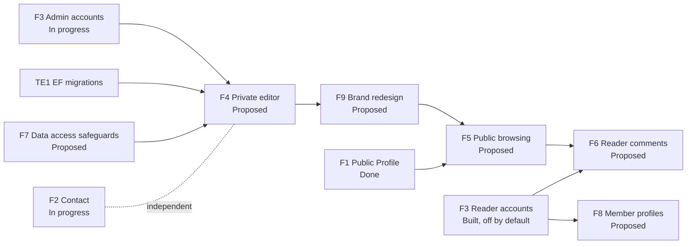

# GooseWebsite: Project Specification and Roadmap

**Audience:** Gustavo, contributors, and AI agents planning work.  
**Last reviewed:** 2026-10-01

This document is the high-level technical specification of GooseWebsite, organized as a Scrum plan. It answers three questions: what are we building technically, in what order, and how do we know each piece is finished.

| Document | Role |
| --- | --- |
| [goal.md](./goal.md) | Why the project exists, in plain language. The ultimate goal. |
| **project.md** (this file) | Technical scope and the Scrum roadmap. |
| [product-backlog.md](./product-backlog.md) | The Product Backlog in detail: every story, acceptance test, and decision. |
| [architecture.md](./architecture.md) | How the code is organized today, with diagrams. Read before changing code. |
| [f3-authentication-architecture.md](./f3-authentication-architecture.md) | Design record for accounts and authentication. |

## 1. Product vision

> A credible public home for Gustavo Couto Vanin where visitors learn who he is, explore his work and selected stories, and reach him safely, and where Gustavo alone controls what is published.

The full statement and principles are in [goal.md](./goal.md). Anything in this plan that conflicts with it is a defect in the plan.

## 2. Technical specification

### 2.1 Solution at a glance

| Concern | Choice |
| --- | --- |
| Shape | One deployable ASP.NET Core application that also serves the Angular client (single origin, no CORS) |
| Backend | ASP.NET Core on .NET 10, organized as a modular monolith (`Accounts`, `Blog`, `Contact` modules over a small shared layer) |
| Frontend | Angular 20 (standalone components, signals), SCSS, built into the API's `wwwroot` |
| Data | SQLite through EF Core; ASP.NET Core Identity for users and roles |
| Sessions | Identity cookie (HttpOnly, SameSite=Lax, Secure in production) with antiforgery tokens on every state-changing request |
| Email | SMTP through a single shared sender (MailerSend today) |
| Delivery | Docker image, with Caddy as the TLS reverse proxy in `docker-compose.yml` |
| Tests | xUnit integration and unit tests for the API; Jasmine/Karma for the client |

### 2.2 Modules

| Module | Responsibility | Releases |
| --- | --- | --- |
| Accounts | Sign-in and sign-out, roles (`Admin`, `Reader`), authorization policies, operator-only administrator provisioning, reader registration and email verification | R1, R3 |
| Contact | Public contact form, abuse controls (honeypot and rate limit), verification-first delivery | R1 |
| Blog | Posts with draft/publish state; the seed that will grow into Stories and Projects | R1, R2 |
| Shared | `DatabaseService` (the single gateway for all database reads and writes), SMTP transport, trusted-proxy headers, module startup hooks | all |
| Client | Public profile and home sections, contact form, blog section, sign-in and verification screens; redesigned in F9 | all |

New product areas (for example Comments and Member Profiles in R3) are added as new modules; see the recipe in [architecture.md](./architecture.md#9-how-to-add-change-or-remove-a-feature).

### 2.3 Quality requirements

These are release gates, taken from the [product backlog](./product-backlog.md) and the architecture decisions.

| Area | Requirement |
| --- | --- |
| Security | Authorization is enforced in the API, never only in the client. Administrator accounts are created only by an operator command. Public registration can never create or elevate an administrator. No credentials, tokens, or message bodies in logs. No secrets in source control. |
| Privacy | No durable message inbox. Pending contact data is deleted after delivery or expiry. Reader email is never returned publicly. Age, exact location, and similar details are never published. |
| Accessibility | WCAG AA contrast, keyboard operable with visible focus, usable at 320 CSS px with no horizontal scroll, reduced-motion respected. |
| Performance | Client bundle stays within the Angular budgets (warning at 500 kB, error at 1 MB initial). Current initial bundle is about 361 kB raw. |
| Maintainability | Features live in their own module. Public contracts are DTOs, never database entities. See the conventions in [architecture.md](./architecture.md#8-conventions). |
| Operability | Same image runs locally and in production; all environment-specific values come from configuration. |

### 2.4 Out of scope

A durable contact inbox, public posting by anyone other than administrators, analytics-driven targets, and OAuth or JWT sign-in.

## 3. Scrum framework

### 3.1 Roles

| Role | Held by | Responsibility |
| --- | --- | --- |
| Product Owner | Gustavo | Owns [goal.md](./goal.md) and the order of the Product Backlog; accepts or rejects finished work; decides visual and content questions. |
| Development Team | Gustavo and AI agents | Build, test, and document each increment. |
| Scrum Master | Gustavo (with agents flagging impediments) | Keeps the process lightweight and the documents current. |

### 3.2 Cadence (proposed)

- **Sprint length:** two weeks (confirmed by Gustavo 2026-10-02). Dates are set at Sprint Planning.
- **Sprint Planning:** pick a Sprint Goal and the stories that serve it. Move stories from `Proposed` to `Ready` only when dependencies and decisions are clear.
- **Daily check-in:** asynchronous. Record impediments in the Sprint Backlog below.
- **Sprint Review:** demonstrate the working increment against the acceptance tests and record evidence in the backlog.
- **Retrospective:** one change to try next sprint. Record it under "Sprint log".

### 3.3 Artifacts

| Scrum artifact | Where it lives |
| --- | --- |
| Product Backlog | [product-backlog.md](./product-backlog.md) (features F1 to F6, stories, acceptance tests) plus the technical enablers in section 6 below |
| Sprint Backlog | Section 5 below: the current sprint's goal and stories |
| Increment | The main line of the repository, deployable as the Docker image |
| Definition of Done | Section 3.4 |

### 3.4 Definitions

**Definition of Ready.** A story is ready when its goal and acceptance tests are written, dependencies are done, open decisions are recorded in the backlog, and its estimate is set (1 US = 12 hours).

**Definition of Done.** A story is done only when all of the following hold.

1. Every acceptance test passes, and the evidence (test name or manual check) is recorded in the backlog.
2. `dotnet test GooseWebsite.slnx` and `npm test -- --watch=false --browsers=ChromeHeadless` (in `src/GooseWebsite.Client`) pass, and the production build succeeds.
3. New behavior has automated tests at the right level (see [architecture.md](./architecture.md#10-testing)).
4. No secrets, personal data, or message content are added to code, config, or logs.
5. The change follows the module conventions and, if structure or contracts changed, [architecture.md](./architecture.md) is updated in the same change.
6. Backlog status, estimate, and decision log are updated.

## 4. Roadmap

### 4.1 Releases

| Release | Outcome | Exit measure | Planned effort |
| --- | --- | --- | --- |
| R1: Credible home base | Public profile, verified contact, administrator sign-in, private editor, new brand design | All R1 gates pass; no sensitive fields exposed; only administrators can edit | 36 US (432 h) |
| R2: Explore the work and stories | Public browsing of published projects and stories | Drafts never visible; every published item reachable | 4 US (48 h) |
| R3: Reader conversation | Verified readers comment on projects and stories and share optional profiles | Only verified readers comment; email stays private; authors own their comments | 13 US (156 h) |

Feature and story details, including acceptance tests, are in the [product backlog](./product-backlog.md).

### 4.2 Dependencies

## 5. Sprint plan

Gustavo confirmed on 2026-10-02 a capacity of about 6 US (72 hours) per sprint as the planning assumption; measure the real velocity in Sprint 1 and re-plan. Each line lists the remaining effort, not the original estimate. Order follows dependencies: foundations and trust first, then the data-access safeguards and the editor, then public pages, then comments.

| Sprint | Sprint Goal | Stories and enablers | Effort |
| --- | --- | --- | --- |
| 0 (done, 2026-10-01) | The project is ready to grow | Modular restructure, rename to GooseWebsite, secrets out of config, goal/project/architecture documents | n/a |
| 1 | Contact is truly verified and R1 sign-in is closed out | F2-US2 remaining work (email the link, stop returning it, confirmation page); F3-US1 close-out (production HTTPS runtime checks); F3-US3 administrator recovery; TE1 EF Core migrations; TE2 CI pipeline; TE3 dependency hygiene | about 5 US |
| 2 | Data access is safe by default, and the editor is protected | F7-US1 database access safeguards (sanitization and access checks in `DatabaseService`); F4-US2 secure administrator editor | 4 US |
| 3 | Gustavo can manage and write content | F4-US1 editor workspace; F4-US3 stories | 5 US |
| 4 | Content can be managed; the new brand foundation exists | F4-US4 projects; F4-US5 image upload; F9-US1 brand and design tokens (needs Gustavo's logo SVG and inspiration image) | 6 US || 5 | The new design covers the shell and home page | F9-US2 site shell; F9-US3 home page redesign | 5 US || 6 | The new design covers every screen and email | F9-US4 contact, blog, and account pages; F9-US5 editor; F9-US6 branded emails | 5 US || 7 | **R1 ships** | F9-US7 accessibility and responsiveness verification; TE5 browser tests and accessibility scan; TE4 remove sample content (deployment gate); R1 release gate (all exit measures) | 4.5 US plus gate || 8 | **R2 ships** | F5-US1 projects; F5-US2 stories | 4 US || 9 | Readers can converse | F3-US4 reader password reset; F6-US1 comment on content; F6-US2 replies; F6-US3 manage own comments | 6 US || 10 | **R3 ships** | F8-US1 create profile with optional details; F8-US2 view another user's profile; F8-US3 edit or remove my details; enable reader registration in production | 5 US plus launch checks |
| 5 | The new design covers the shell and home page | F9-US2 site shell; F9-US3 home page redesign | 5 US |
| 6 | The new design covers every screen and email | F9-US4 contact, blog, and account pages; F9-US5 editor; F9-US6 branded emails | 5 US |
| 7 | **R1 ships** | F9-US7 accessibility and responsiveness verification; TE5 browser tests and accessibility scan; TE4 remove sample content (deployment gate); R1 release gate (all exit measures) | 4.5 US plus gate |
| 8 | **R2 ships** | F5-US1 projects; F5-US2 stories | 4 US |
| 9 | Readers can converse | F3-US4 reader password reset; F6-US1 comment on content; F6-US2 replies; F6-US3 manage own comments | 6 US |
| 10 | **R3 ships** | F8-US1 create profile with optional details; F8-US2 view another user's profile; F8-US3 edit or remove my details; enable reader registration in production | 5 US plus launch checks |

### Current sprint backlog (Sprint 1, not yet started)

Fill in dates and owners at Sprint Planning. Statuses use the backlog vocabulary (`Proposed`, `Ready`, `In Progress`, `Blocked`, `Done`).

| Item | Status | Notes |
| --- | --- | --- |
| F2-US2: email the verification link, remove token and URL from the response, add confirmation page | Done | Verified end to end 2026-10-06; see the story |
| F3-US1: record production HTTPS runtime checks | In Progress | All implementation tasks are checked; only deployment evidence remains |
| F3-US3: administrator recovery command | Ready | Operator-only reset command approved 2026-10-02 |
| TE1 to TE3 | Proposed | See section 6 |

### Sprint log

| Sprint | Result | Retrospective change |
| --- | --- | --- |
| 0 | Restructured into modules; 20 API tests and 2 client tests pass; Docker image builds and serves the app | Keep documents and code changes in the same change |

## 6. Technical enablers

Enablers are work that is not a product feature but that the features depend on. They are sized with the same effort unit. All estimates are proposed and need confirmation.

| ID | Enabler | Why now | Estimate |
| --- | --- | --- | --- |
| TE1 | Replace `EnsureCreated` with EF Core migrations and baseline the existing database | The editor (F4) changes the schema; `EnsureCreated` cannot evolve an existing database | 1 US |
| TE2 | CI pipeline: build, run both test suites, build the Docker image | Nothing currently stops a regression from merging | 1 US |
| TE3 | Dependency hygiene: resolve the `SQLitePCLRaw.lib.e_sqlite3` high-severity advisory (NU1903) and run `npm audit` | The build already warns about the advisory | 0.5 US |
| TE4 | Remove sample content: the hard-coded posts in the blog section, placeholder "selected work", and the demo posts in local databases. Gustavo: leave in place during development, remove before deployment | R1 requires no sample content; this is a deployment gate in Sprint 4 | 0.5 US |
| TE5 | Browser tests and an automated accessibility scan | Several acceptance tests (320 px, keyboard, contrast) are manual today | 2 US |

Enablers total 5 US (60 hours) and are in addition to the 53 US of product features.

## 7. Risks and open decisions

| Item | Impact | Next step |
| --- | --- | --- |
| SMTP credentials were committed to `appsettings.json` and `CLAUDE.md` before 2026-10-01 | Anyone with the repository or a copy can send mail as the sender | Rotate the MailerSend key and password; the values in git history stay exposed if a repository is ever created from earlier copies |
| Pending contact messages live in memory | Lost on restart; works only with one instance | Acceptable for R1 (matches the no-inbox decision); revisit if the site scales out |
| `DatabaseService` has no input sanitization or access checks yet | Every caller must remember its own checks | Sprint 2, F7-US1 |
| The logo and inspiration image for the redesign (F9) were supplied on 2026-10-02, but the hero illustration file and the GitHub and LinkedIn URLs are still missing; the logo is a raster PNG inside an SVG | F9-US1 and F9-US3 cannot be Ready without them | Gustavo to provide the remaining items before Sprint 4 |
| The redesign is built after the editor, so F4 screens are first built in the current look | Some rework in F9-US5 | Accepted by Gustavo (design after R1 features, before launch); keep editor styles on shared tokens where possible |
| Accessibility is verified after the redesign rather than during it | A late finding could delay R1 | F9-US7 is a launch gate; run the automated scan (TE5) early in F9 |
| Decisions listed at the end of the backlog (image formats and limits, URL and deletion behavior, browser matrix) | Block F4-US5, F5, and F6 stories from becoming `Ready` | Decide before the sprint that needs them |

## 8. Ideas parked for later

These came from the earlier "Plan to Stand Out" and are not committed. They are archived in full in `Docs/archive/plan.md`. Promote an item into the Product Backlog only with a goal and acceptance tests.

- Real case studies with decisions and measurable outcomes (this is what the Projects feature in F4 and F5 will hold).
- A "now" page, a downloadable resume generated from the same profile data, and verified testimonials.
- Page metadata, structured data, a sitemap, and an RSS feed for stories.
- A lightweight interactive architecture playground as a signature feature.
- Visual regression snapshots and Lighthouse checks in CI (extends TE2 and TE5).

Items from that plan that conflict with the confirmed decisions, such as a durable contact store and consent handling for a stored inbox, are intentionally dropped.
